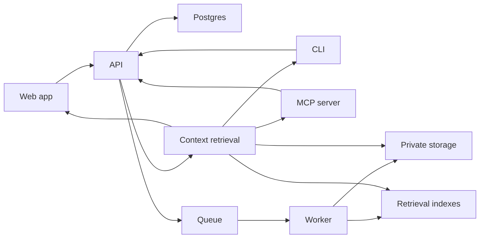

# Architecture

Sivraj is a memory-first AI workspace built around a user-owned Twin. The system stores private context, processes source material, and returns permissioned context to first-party and external AI surfaces.

## System Components

## Web App

The web app is the primary user control plane. It owns onboarding, wallet connection, uploads, chat, provider settings, memory review, and permission management.

## API

The API owns durable product state. It should model lifecycle state explicitly instead of relying on UI inference. It coordinates identity, Twin records, source metadata, context requests, and integration boundaries.

## Worker

The worker handles background processing for uploaded and connected sources. It extracts usable context, updates processing status, and prepares retrieval indexes.

## Retrieval

Retrieval combines structured metadata, indexed passages, source references, permission checks, and task context. External tools receive bounded context packets rather than unrestricted memory.

## Storage And Permissions

Private source material is protected through encrypted storage and permission checks. Public docs should describe the architecture at this level without publishing deployment secrets or private object identifiers.

## Design Constraints

- User memory is private by default.
- Integrations request scoped context for a stated purpose.
- Backend state owns durable lifecycle milestones.
- Processing can be queued, partial, retried, or failed.
- Answers should preserve evidence references where possible.
