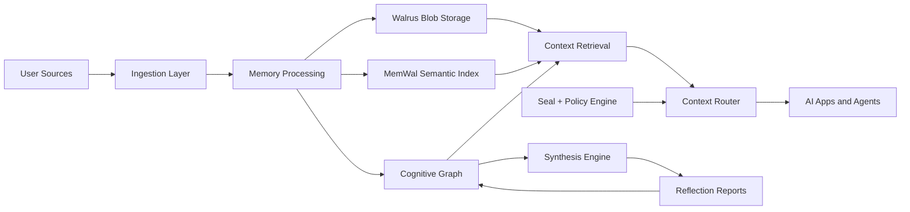

# Architecture

## System Overview

Sivraj is a persistent intelligence layer made of six core systems:

1. Ingestion layer.
2. Memory processing pipeline.
3. Cognitive graph.
4. Retrieval and context routing.
5. Synthesis engine.
6. Sovereign permission and storage layer.

## High-Level Flow

## Core Services

### Ingestion Service

Responsibilities:

- Accept uploads and connected-source imports.
- Normalize file metadata.
- Extract text from supported formats.
- Track provenance and source authority.
- Queue processing jobs.

Initial source adapters:

- Markdown/text.
- PDF.
- GitHub.
- Chat exports.
- Manual memory entry.

### Memory Processing Service

Responsibilities:

- Chunk documents.
- Generate embeddings.
- Extract entities.
- Extract candidate memories.
- Classify content.
- Generate summaries.
- Link content to graph nodes.

### Cognitive Graph Service

Responsibilities:

- Store and update identity graph entities.
- Represent relationships between people, projects, goals, decisions, preferences, and patterns.
- Preserve source citations.
- Track confidence and evidence.

### Retrieval Service

Responsibilities:

- Accept query and caller identity.
- Apply permission constraints.
- Perform semantic retrieval.
- Rank context.
- Compose bounded context packets.
- Return citations and confidence.

### Synthesis Service

Responsibilities:

- Detect recurring patterns.
- Generate strategic insights.
- Produce weekly or event-driven reflections.
- Update graph assumptions.
- Identify contradictions and drift.

### Permission Service

Responsibilities:

- Manage user-owned access policies.
- Evaluate agent scopes.
- Integrate Seal encryption.
- Enforce least-privilege context access.

## Infrastructure Roles

### Walrus

Used for:

- Raw archives.
- Memory blobs.
- Agent histories.
- Reasoning traces.
- Long-term identity state snapshots.

### MemWal

Used for:

- Embeddings.
- Semantic retrieval.
- Memory ranking.
- Long-term recall.
- Context selection.

### Seal

Used for:

- Encrypting private memory.
- Scoped access.
- Confidential agent coordination.

### Sui

Used for:

- User identity.
- Ownership primitives.
- Programmable permissions.
- Future portability and user-controlled access rights.

## Context Packet

A context packet is the bounded memory bundle passed to an AI system.

It should include:

- Relevant memories.
- Project state.
- User preferences.
- Active goals.
- Constraints.
- Citations.
- Permission scope.
- Expiration policy.

It should not include:

- Unrelated private data.
- Raw archives unless explicitly authorized.
- Memories outside the caller's scope.
- Irrelevant historical context.

## Recommended Initial Stack

This can change during implementation, but a reasonable starting stack is:

- TypeScript.
- Next.js or Vite for the app.
- Node.js backend API.
- Postgres for relational metadata and graph edges.
- pgvector or MemWal for early semantic retrieval if MemWal is not fully integrated yet.
- Queue worker for ingestion jobs.
- Object storage abstraction with Walrus adapter.
- LLM provider abstraction.

## Architectural Principles

- Store raw source, processed memories, and synthesized insights separately.
- Every memory should be traceable to evidence.
- The graph should support uncertainty and revision.
- Retrieval should be scoped by permission before context leaves the system.
- Synthesis should update assumptions, not overwrite reality.
- Agents should receive least-privilege context packets.

