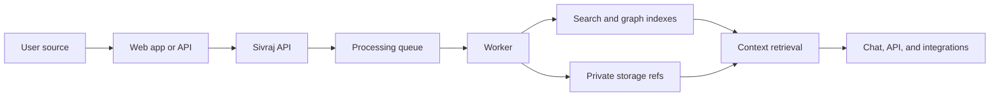

# Infrastructure

Sivraj is built as a TypeScript monorepo with separate apps for the web product, API, workers, command-line tools, and integration surfaces.

## Runtime Shape

- **Web app:** user-facing control plane for onboarding, memory, chat, uploads, providers, and permissions.
- **API:** HTTP service for identity, Twin state, memory operations, context retrieval, provider configuration, and integration endpoints.
- **Worker:** background processing for uploaded or connected source material.
- **CLI:** developer-oriented entry point for scripted workflows and future local context capture.
- **MCP server:** integration surface for tools that speak the Model Context Protocol.

## Core Storage

- **Postgres:** application state, Twin records, metadata, processing state, permissions, and audit-oriented records.
- **Redis:** local queue and coordination support.
- **Walrus:** private source and memory storage references.
- **Seal:** encryption and access-control layer for protected memory material.

## Processing Flow

## Configuration Model

Configuration is service-owned and should be explicit:

- Public web values are intentionally exposed at build/runtime.
- Server secrets stay server-side.
- New runtime variables should be documented in `.env.example`.
- Shared config should flow through the config package rather than ad hoc process reads.

Do not publish real deployment values, private keys, wallet seeds, object IDs tied to private deployments, or provider credentials in documentation.

## Operational Expectations

Sivraj should tolerate reloads, retries, reconnects, partial processing failures, and legacy records. Durable user milestones belong in backend state, not inferred from UI side effects.

Background work should expose explicit status so users can tell whether context is queued, processing, available, failed, or needs retry.
